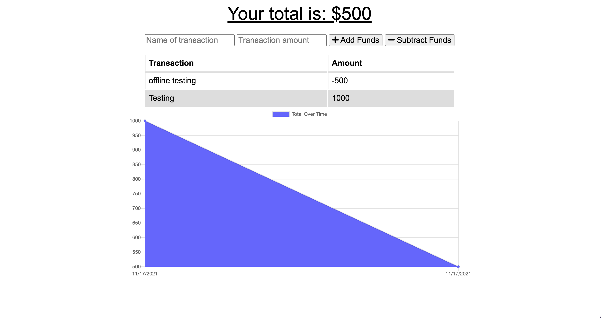

# Online/Offline Budget Trackers

This application adds functionality to an existing Budget Tracker application to allow for offline access and functionality.

The user will be able to add expenses and deposits to their budget with or without a connection. When entering transactions offline, they should populate the total when brought back online.

Offline Functionality:

  * Enter deposits offline

  * Enter expenses offline

When brought back online:

  * Offline entries should be added to tracker.

## User Story
AS AN avid traveller
I WANT to be able to track my withdrawals and deposits with or without a data/internet connection
SO THAT my account balance is accurate when I am traveling

## Acceptance Criteria
GIVEN a user is on Budget App without an internet connection
WHEN the user inputs a withdrawal or deposit
THEN that will be shown on the page, and added to their transaction history when their connection is back online.

## Screenshot

The following image shows the application's appearance and functionality:

The URL of the Heroku application is: 
<https://akn-online-offline-budget.herokuapp.com/>

The URL of the GitHub repository is: 
<https://github.com/ArshleenKNagpal/Online-Offline-Budget-Trackers>

---
© 2021 Trilogy Education Services, LLC, a 2U, Inc. brand. Confidential and Proprietary. All Rights Reserved.